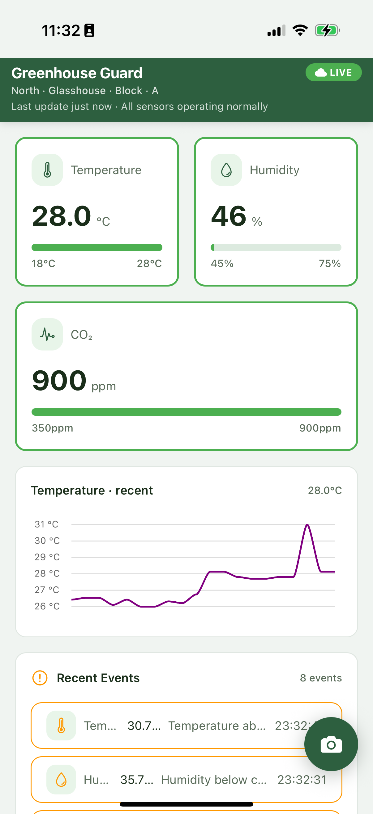
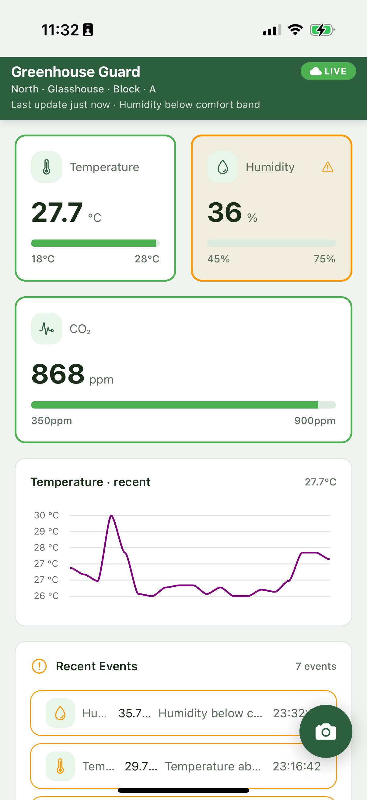
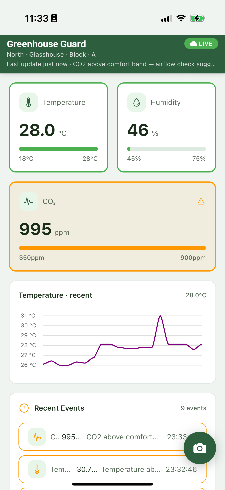
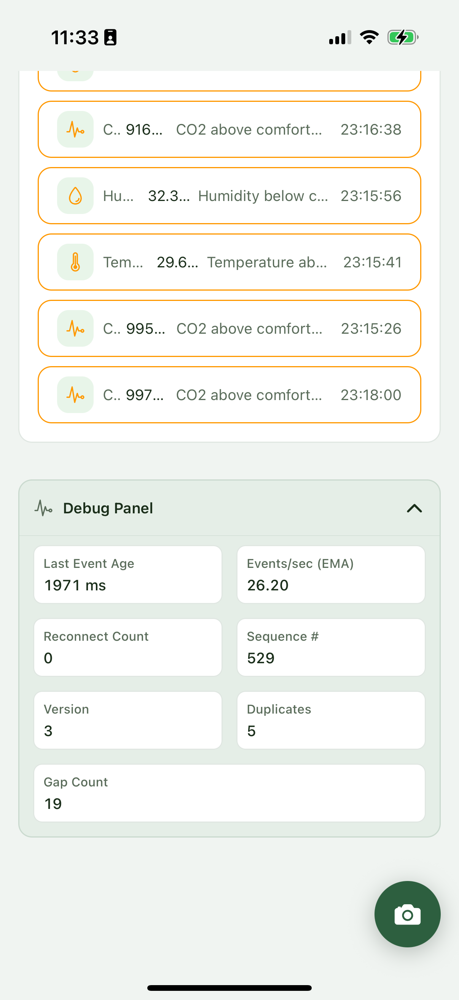

# Greenhouse Guard

A React Native app that monitors greenhouse sensors in real time — temperature, humidity, CO₂ — with a live sparkline, anomaly event feed, offline SQLite cache, and a camera FAB that queues plant photos for upload.

> **Backend:** The companion .NET server that streams sensor data is at [geniecoder/GreehouseServer](https://github.com/geniecoder/GreehouseServer).

---

## Demo

▶ [Watch app demo on YouTube](https://youtube.com/shorts/ZzCebnnnHqs?feature=share)

---

## Screenshots

| | | | |
|:---:|:---:|:---:|:---:|
|  |  |  |  |

---

## Setup

1. **Clone and install**

   ```bash
   git clone https://github.com/geniecoder/greenhouse.git
   cd greenhouse
   npm install
   ```

2. **Start the backend server**

   Clone and run [geniecoder/GreehouseServer](https://github.com/geniecoder/GreehouseServer) on the same LAN, then open `src/config/greenhouseLive.ts` and point the app at it:

   ```ts
   export const GREENHOUSE_LIVE_HOST = '192.168.1.140'; // your server IP
   export const GREENHOUSE_LIVE_PORT = 5050;
   ```

   Everything else (snapshot URL, WebSocket URL, image upload URL) derives from those.

3. **Native build** — required once, and any time you change `app.json` plugins or add native packages:

   ```bash
   npx expo run:android --device
   # or
   npx expo run:ios
   ```

---

## How the transport works

| Stage | What happens |
|---|---|
| **App open** | `GET /api/snapshot` — one request bootstraps all sensor readings, thresholds, chart history, and the latest anomalies into SQLite. |
| **Live** | WebSocket (`/ws`) streams `reading_delta` and `anomaly_event` frames. Each one updates tiles, chart, and SQLite in real time. |
| **Reconnect** | WS uses exponential backoff. On successful reconnect the app re-fetches the snapshot so chart history stays aligned with the server rather than frozen. |
| **Offline** | If the snapshot fetch fails on launch, the app hydrates from the last SQLite session so you still see recent readings and events without any error screen. |
| **Photos** | Camera shot → saved to `documentDirectory/plant-photos/` → queued in SQLite → `POST /api/upload-image` (multipart, field `image`) when online. Retried every 12 s and on app resume until it succeeds. |

---

# Design & Trade-offs Note

## 1. Overview

This project implements a real-time greenhouse monitoring system with a mobile client and backend service.

**Components:**
- Mobile App: React Native (TypeScript)
- Backend: .NET (C# Web API + WebSocket)
- Storage: SQLite (client-side), server-side storage (in-memory / DB)
- Transport: HTTP (snapshot) + WebSocket (real-time)

**Goal:**
Provide low-latency live sensor updates while ensuring reliable initial load, offline support, and resilience to network interruptions.

---

## 2. Architecture & Data Flow

**Flow:**
1. App starts → calls REST API → fetches snapshot (last N readings)
2. App connects to WebSocket → receives real-time updates
3. Incoming data is:
   - Stored in SQLite
   - Passed to state/reducer → UI updates
4. On disconnect → reconnect → resync using snapshot API

---

## 3. Key Design Decisions

### 3.1 Hybrid Transport (HTTP + WebSocket)

- HTTP (REST) → initial data fetch  
- WebSocket → real-time streaming  

**Why:**
- Avoids inefficient polling
- Reduces latency
- Clean separation between snapshot and live updates

---

### 3.2 Local Storage (SQLite)

All readings are stored locally.

**Why:**
- Enables offline support
- Faster UI rendering
- Reduces dependency on network

---

### 3.3 Frontend Structure

**Why:**
- Clear separation of concerns
- Easier testing and scalability
- Maintainable codebase

---

### 3.4 Event-driven State Management

WebSocket messages are processed through reducer/state updates.

**Why:**
- Predictable state changes
- Easier handling of edge cases (duplicates, ordering, bursts)

---

## 4. Trade-offs

### 4.1 WebSocket vs Polling

| Option     | Pros                     | Cons                              |
|------------|--------------------------|-----------------------------------|
| WebSocket  | Real-time, efficient     | More complex (reconnect handling) |
| Polling    | Simple                   | High latency, network overhead    |

**Decision:** WebSocket for real-time updates.

---

### 4.2 SQLite vs Cloud-only Storage

| Option        | Pros                    | Cons               |
|---------------|-------------------------|--------------------|
| SQLite        | Offline, fast           | Sync complexity    |
| Cloud only    | Simpler backend         | No offline support |

**Decision:** SQLite for better user experience.

---

### 4.3 Single Payload vs Multiple Event Types

| Option               | Pros                | Cons                 |
|---------------------|---------------------|----------------------|
| Single JSON payload | Simple parsing      | Slightly larger size |
| Multiple events     | Flexible            | More complex logic   |

**Decision:** Single structured payload.

---

### 4.4 WebSocket vs MQTT

| Option     | Pros                        | Cons                    |
|------------|-----------------------------|--------------------------|
| WebSocket  | Easy integration            | Less IoT optimized       |
| MQTT       | Lightweight, pub/sub model  | Requires broker setup    |

**Decision:** WebSocket for simplicity and faster development.

---

## 5. Reliability & Edge Cases

Handled scenarios:
- Duplicate events → deduplicated using ID/timestamp
- Out-of-order events → sorted/validated in reducer
- Burst updates → handled safely without state corruption
- Disconnect/reconnect → auto reconnect + resync
- Partial events (e.g., anomaly_event) → still update latest reading

---

## 6. Scalability Considerations

Future improvements:
- WebSocket scaling (load balancer, sticky sessions)
- Message queue (Kafka / RabbitMQ)
- Persistent backend storage (PostgreSQL / time-series DB)
- Authentication and authorization
- Rate limiting and backpressure handling

---

## 7. Future Enhancements

- Background sync when app reconnects
- Offline upload queue (images, logs)
- Push notifications for alerts
- Historical analytics dashboard
- Multi-device/sensor support

---

## 8. Summary

The system uses a hybrid communication model (HTTP + WebSocket) combined with local storage (SQLite) to balance:

- Performance (real-time updates)
- Reliability (resync and offline support)
- Simplicity (clean architecture)

The design prioritizes user experience and developer productivity while remaining scalable for future growth.
